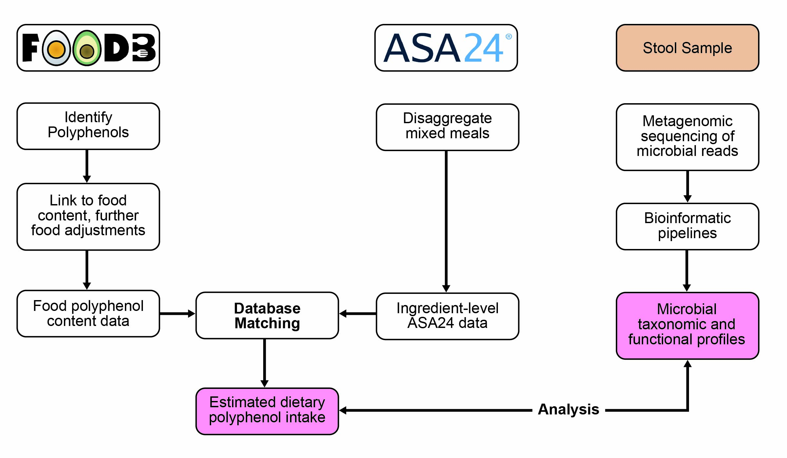

# READ ME

This repository contains scripts for the analysis of dietary polyphenol intake and gut microbial taxonomic and polyphenol utilization capacity (Figure 1). Methods for deriving polyphenol intake have been previously described by Wilson et al 2024.[^1] Code for ASA24 to FooDB polyphenol intake estimation are available on
    <a href="https://github.com/SWi1/FooDB_polyphenol_analysis">GitHub</a>.

<figure>
  
  <figcaption>Figure 1: Simplified visual overview of study methods. Current scripts analyze relationships between dietary polyphenol intake and microbial data. 
  </figcaption>
</figure>

## Software

-   **RStudio 2025.05.0+496 "Mariposa Orchid" using R 4.4.2**, for data cleaning, analysis, and visualizations
-   **TaxaHFE version 2.0**, for feature reduction using taxaHFE-ML
    -  [taxaHFE Paper](https://doi.org/10.1093/bioadv/vbad165)
    -  [GitHub Repository](https://github.com/aoliver44/taxaHFE)
-   [dietML](https://github.com/aoliver44/nutrition_tools) - For machine learning   

## Required Files

**Data Availability**

Food composition database data that are publicly available (FooDB, PhenolExplorer) are provided in [this GitHub Repository](https://github.com/SWi1/FooDB_polyphenol_analysis). Requests for non-metagenomic data from the USDA ARS WHNRC Nutritional Phenotyping Study used in this analysis should be made via an email to the senior WHNRC author on the publication of interest. Requests are reviewed quarterly by a committee consisting of the study investigators. 

**Data**
        
-   **Dietary Recalls**, Not Publicly Available, Originally downloaded as Items Analysis File from the ASA24 Researcher Site. The dietary data utilized in the USDA Phenotyping Study underwent [quality control](https://doi.org/10.1093/cdn/nzab005) then meal disaggregation. 

-   **FooDB**, Publicly Available, Download from [foodb.ca/downloads](https://foodb.ca/downloads). FooDB Data Dictionary for Content, Compound, and Food csv files are provided [here](https://github.com/SWi1/FooDB_polyphenol_analysis/blob/main/FooDB/README.md).

-   **Phenol Explorer Version 3.6**, Publicly Available, Download from [phenol-explorer.eu/downloads](http://phenol-explorer.eu/downloads)

-   **dbPUP**, Publicly Available, Downloadable from the Yin Lab at the University of Nebraska Lincoln [here](https://bcb.unl.edu/dbpup/download). The citation for dbPUP is available here: [*"Polyphenol Utilization Proteins in the Human Gut Microbiome"*](https://journals.asm.org/doi/10.1128/aem.01851-21).
 
-   **USDA Phenotyping Study Fecal Metagenomes**, Publicly Available, Download from:
    - NCBI Sequence Read Archive [SRP354271](https://www.ncbi.nlm.nih.gov/sra/?term=SRP354271), 290 participants
    - NCBI Sequence Read Archive [SRP497208](https://www.ncbi.nlm.nih.gov/sra/?term=SRP497208), 40 participants

## Overview of Scripts
Scripts in each set are intended to be run sequentially.

1)  **Data Preparation**. This set of scripts cleans and prepares cohort metadata, microbial, and polyphenol intake data for downstream analyses.
    -   A0a_metadata_prep.R
    -   A0b_microbiome_prep.R
    -   A0c_taxaHFE_prep.R
    -   A0d_alpha_diversity_prep.Rmd
    -   A0e_LPS_microbes_prep.Rmd
    -   A1a_dbPUP_substrate_prep.R
    -   A1b_dbPUP_file_prep.R
    -   A1c_dbPUP_class_prep.Rmd
    -   A2a_Substrate_MatchFooDBids.R
    -   A2b_Substrate_FooDB_Taxonomy.Rmd
    -   A2c_Substrate_Extract_Comp_Data.Rmd
    -   A2d_Substrate_ASA24_Match.Rmd
    -   A2e_dbPUP_class_compound_intake_prep.Rmd
    
2)  **Taxonomy Analyses**. These scripts perform a statistical overview of the cohort by low and high polyphenol intake quartiles followed by analyses between polyphenol intake (total) and the alpha and beta diversity of the gut microbiome.

    -   B1_Participant_table.Rmd
    -   B2_LPS_producer_modelling.Rmd
    -   B3_alphaDiversity_models.Rmd
    -   B4a_taxaHFE_run.sh
    -   B4b_BetaDiv_permanova_loop.R
    -   B4c_BetaDiv_quartilenosf.R

3)  **Functional Analyses**. These scripts perform analyses between polyphenol intake (total, class, compound) and PUP gene counts as well as the abundance of PUP-containing microbial genera. Analyses were run with (rank-based estimation regression) and without covariates (Spearman correlation). Covariates included: Age, Sex, BMI, Fiber Intake (g/1000 kcal), and diet quality (Total HEI-2015 Score). Summary plots for covariate-adjusted models were created.
    -   C0a_PUP_Modelling_DataPrep.Rmd
    -   C1a_PUP_Correlation_Count.Rmd
    -   C1b_PUP_Correlation_Abundance.Rmd
    -   C1c_PUP_Correlation_Summary.Rmd
    -   C2a_PUP_Modelling_Count.Rmd
    -   C2b_PUP_Modelling_Abundance.Rmd
    -   C2c_PUP_Modelling_Summary.Rmd
    -   C3_PUP_Model_Comparisons.Rmd
    -   C4a_PUP_Taxonomy_Prevalence_PLOT.Rmd
    -   C4b_PUP_Modelling_PLOT.Rmd

4)  **Inflammation Modelling**. These scripts perform analyses related to lipopolysacharride binding protein (LBP). Linear models are first run to determine whether polyphenol intake alpha diversity predicts PUP gene alpha diversity and if PUP gene alpha diversity predicts LBP. Regarding machine learning models, hierarchical feature engineering is performed on PUP genes and PUP-containing microbes. Engineered features are combined with covariates and run in random forest machine learning models. Performance and SHAP plots are generated.
    -  D0_PUP_diversity_ML_prep.Rmd
    -  D1_LBP_PUP_Alpha_diversity.Rmd
    -  D2_ML_HFE_PUP_run.sh
    -  D2a_ML_HFE_convert_output.Rmd
    -  D3_ML_dietML_multiseed_loop.sh
    -  D4a_ML_PUP_Performance.Rmd
    -  D4b_ML_PUP_SHAP.Rmd
    -  D5a_ML_PUP_MB_Performance.Rmd
    -  D5b_ML_PUP_MB_SHAP.Rmd
    -  D6a_ML_Publication_SHAP_Plot.Rmd
    -  D6b_ML_Publication_Correlation_Plot.Rmd

----

[^1]: [Wilson et al. 2024. Journal of Nutrition.](https://doi.org/10.1016/j.tjnut.2024.08.010).

